# (C# 코딩) 키오스크 주문 프로그램

## 목차
1. 개요
2. 과제 1
3. 과제 2
4. 과제 3
5. 과제 4

---

## 1. 개요
본 실습은 C# Windows Forms(.NET 8) 환경에서 버거 주문 키오스크(Burger Kiosk)를 구현하는 과제이다. Visual Studio 2026을 사용하여 컨트롤 배치, 이벤트 처리, 사용자 입력 검증, 키보드 조작, 실시간 UI 갱신 기능을 단계적으로 구현하였다. 각 단계별 과제를 통해 사용자 인터페이스 설계와 이벤트 기반 프로그래밍 구조를 이해하고, 실제 키오스크와 유사한 주문 시스템을 완성하는 것을 목표로 한다.

- 사용한 플랫폼  
  : C#, .NET Windows Forms, Visual Studio, GitHub  

- 사용한 컨트롤  
  : Label, GroupBox, RadioButton, CheckBox, ListBox, Button, PictureBox  

- 사용한 기술과 구현 기능  
  : Visual Studio를 이용한 UI 디자인  
  : 이벤트 기반 프로그래밍  

- 수업 중에 배우고 사용했던 클래스들 관련된 설명  
  - string: 사용자 선택값을 문자열로 저장하고 처리  

- 실습 중에 구현한 기능들 설명  
  : 메뉴 및 옵션 선택 기능 구현  
  : 주문 내역 출력 및 총 금액 계산 기능 구현  
  : 입력 검증 및 오류 메시지 표시 기능 구현  
  : 키보드 입력 기반 주문 기능 구현  
  : 선택 즉시 UI 갱신 기능 구현  

---

## 2. 과제 1

### 실행 화면

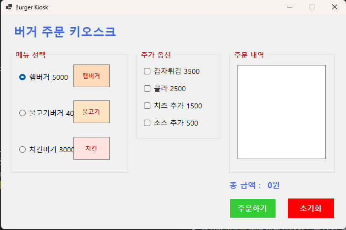
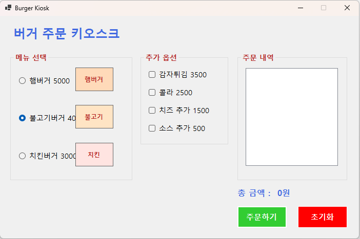
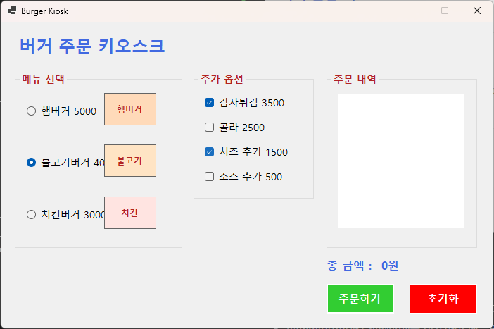
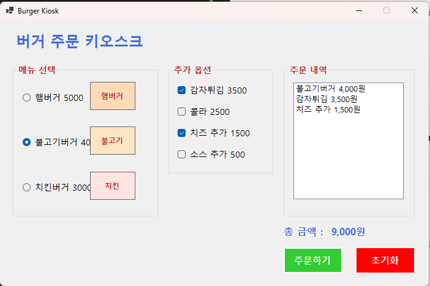

### 과제 내용
- 컨트롤 배치와 기본적인 속성 설정을 수행한다.  
- RadioButton과 CheckBox를 이용하여 메뉴와 옵션을 구성한다.  
- GroupBox를 사용하여 메뉴와 옵션을 구분한다.  
- 주문하기 버튼과 초기화 버튼의 기능을 구현한다.  
- 주문 내역과 총 금액을 화면에 표시한다.  

### 구현 내용과 기능 설명
- Label, GroupBox, RadioButton, CheckBox, ListBox, Button, PictureBox를 활용하여 키오스크 UI를 구성하였다.  
- 메뉴는 RadioButton으로 구성하여 하나만 선택되도록 구현하고, 옵션은 CheckBox를 사용하여 복수 선택이 가능하도록 구성하였다.  
- GroupBox를 활용하여 메뉴 영역과 옵션 영역을 구분하여 사용자 인터페이스를 명확하게 구성하였다.  
- 주문하기 버튼 클릭 시 선택된 메뉴와 옵션을 ListBox에 출력하고, 선택된 항목의 가격을 합산하여 총 금액을 Label에 표시하도록 구현하였다.  
- 초기화 버튼을 통해 선택 상태와 주문 내역, 총 금액을 모두 초기 상태로 되돌리는 기능을 구현하였다.  

---

## 3. 과제 2

### 실행 화면

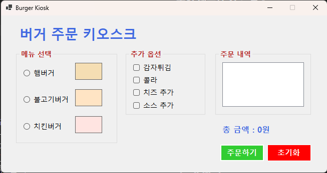
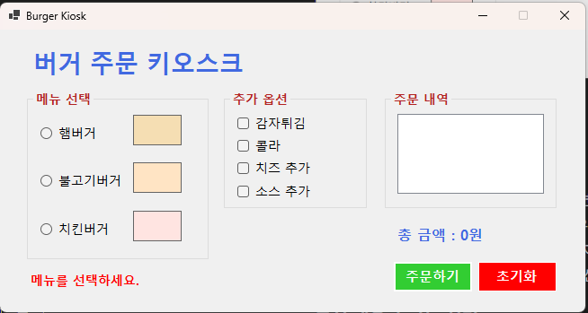
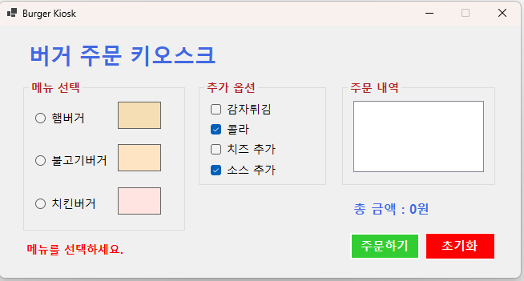
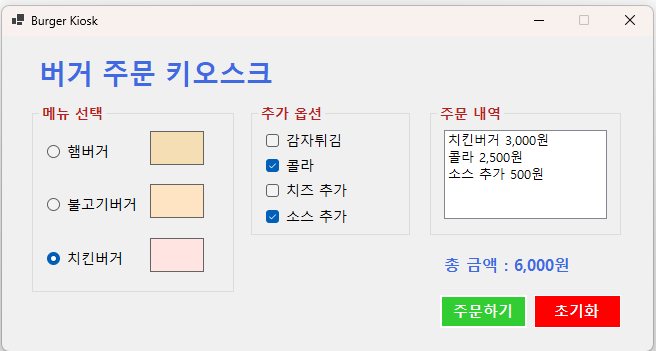

### 과제 내용
- 아무것도 선택하지 않고 주문하기 버튼을 누를 경우 에러 메시지를 표시한다.
- MessageBox 대신 Label을 활용하여 화면에 에러 메시지를 출력한다.
- 메뉴를 선택하지 않고 옵션만 선택한 경우에도 에러로 처리한다.
- 초기 화면에서는 RadioButton이 선택되지 않도록 설정한다.
- 잘못된 입력 시 주문 내역과 총 금액이 갱신되지 않도록 한다.

### 구현 내용과 기능 설명
- 초기 화면에서 RadioButton이 선택되지 않도록 Form Load 및 Shown 이벤트에서 Checked 값을 모두 false로 설정하였다.
- 사용자가 메뉴를 선택하지 않고 주문하기 버튼을 클릭했을 경우, Label 컨트롤에 “메뉴를 먼저 선택한 후 옵션을 선택하세요.”라는 메시지를 출력하도록 구현하였다.
- CheckBox만 선택된 경우에도 메뉴가 선택되지 않은 상태이므로 동일한 에러 메시지가 출력되도록 조건문을 구성하였다.
- MessageBox를 사용하지 않고 화면 하단의 Label을 활용하여 사용자에게 자연스럽게 오류를 안내하도록 구현하였다.
- 에러 발생 시 ListBox의 주문 내역을 초기화하고, 총 금액 Label을 “0원”으로 유지하도록 처리하여 잘못된 주문이 반영되지 않도록 하였다.
- 정상적인 메뉴 선택이 이루어진 경우에만 주문 내역과 총 금액이 계산되도록 분기 처리하여 프로그램의 안정성을 확보하였다.
---

---

## 4. 과제 3

### 실행 화면

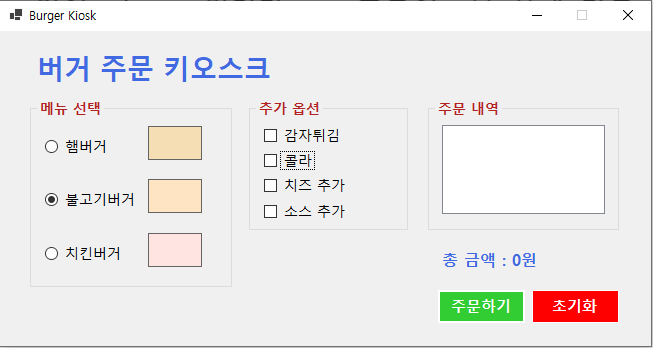
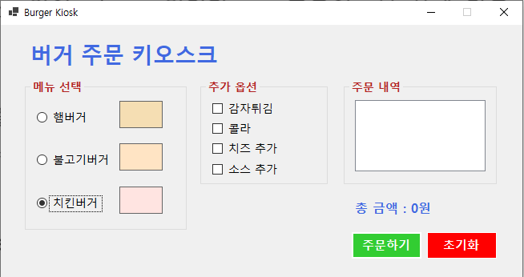
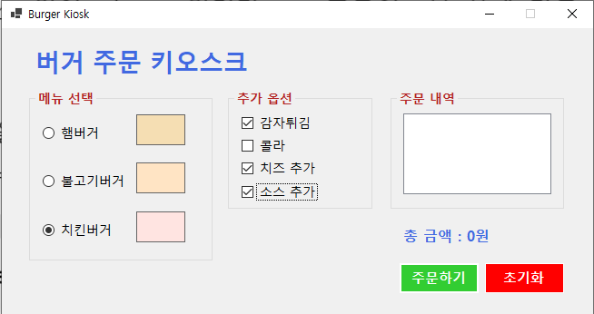
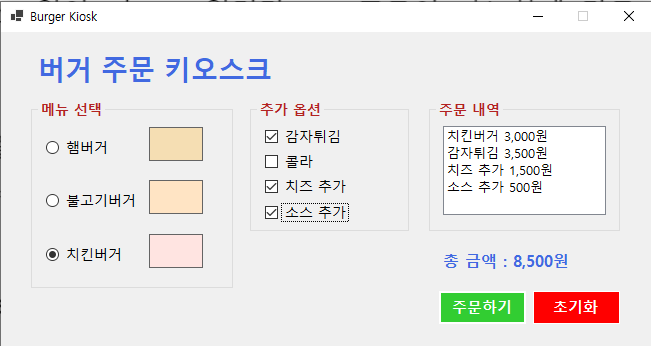

### 과제 내용
- 마우스 없이 키보드 입력만으로 주문이 가능하도록 구현한다.  
- Tab을 이용해서 GroupBox 사이를 이동한다.  
- 방향키를 이용해서 선택 아이템 사이를 이동한다.  
- 스페이스바를 이용해서 아이템을 선택한다.  
- Enter키로 버튼을 누를 수 있도록 구현한다.  

### 구현 내용과 기능 설명
- 각 컨트롤의 TabIndex를 조정하여 키보드만으로 이동이 가능하도록 구성하였다.  
- RadioButton은 같은 메뉴 그룹 안에서 방향키로 선택이 이동되도록 기본 동작을 활용하였다.  
- CheckBox는 포커스가 있는 상태에서 스페이스바를 누르면 선택과 해제가 가능하도록 하였다.  
- Form의 AcceptButton을 주문하기 버튼으로 지정하여 Enter 키 입력 시 주문이 실행되도록 구현하였다.  
- 초기 화면에서는 라디오 버튼이 선택되지 않도록 유지하면서도 키보드 포커스는 첫 번째 메뉴 항목으로 이동되도록 보정하였다.  
- 메뉴를 선택하지 않은 상태에서 Enter 키로 주문을 시도하면 기존 과제 2단계와 동일하게 라벨에 경고 문구가 표시되도록 유지하였다.
